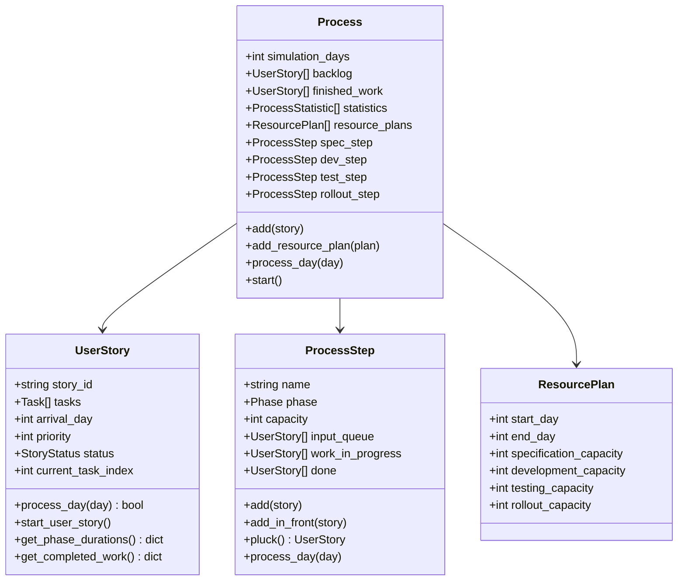
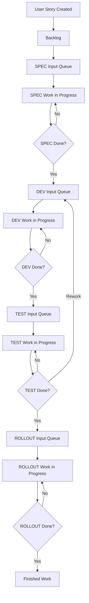

# DevCycleSim

DevCycleSim is a Python-based simulation framework for modeling agile development processes. It simulates the flow of work items (user stories) through the phases of Specification, Development, Testing, and Rollout - with built-in error handling and rework dynamics.

## Idea

The simulation represents the software development process as a factory where user stories (features/modules) pass through different production stations. Each user story has specific time requirements (in days) for the Specification, Development, Testing, and Rollout phases. For example, a story might require 1 day for Specification, 2 days for Development, 1 day for Testing, and 1 day for Rollout.

A key aspect is that a user story can only move to the next phase once its current phase is fully completed. In each phase, one person can only work on one user story at a time. So if a story requires 3 days of specification work, it occupies one full capacity unit for those 3 days. With a capacity of 2 units in the "Specification phase", a maximum of 2 stories can be processed in parallel.

Special features of the simulation:

- Flexible resource planning through ResourcePlans that define different capacities for various time periods
- Detailed statistics for each simulation day
- Support for rework by returning stories to earlier phases
- Prioritization of rework through automatic placement at the front of the queue
- Configurable story generation with random or predefined properties

This detailed modeling enables the investigation of resource constraints and process dynamics, providing valuable insights into the practical application of agile practices.

## CLI Usage

DevCycleSim provides a command-line interface (CLI) for running simulations. Here are the main options:

```bash
devcyclesim run [OPTIONS]
```

### Options

- `--duration INTEGER`: Simulation duration in days (default: 14)
- `--resource-plan TEXT`: Format: "start-end:spec,dev,test,rollout" (can be used multiple times)
- `--resource-plans-file FILE`: JSON file with resource plans
- `--stories-file FILE`: JSON file with user stories
- `--generate-stories INTEGER`: Number of stories to generate
- `--seed INTEGER`: Random seed for reproducible results
- `--output-format [text|json|csv]`: Output format (default: text)
- `--output-file FILE`: Output file (default: stdout)
- `--verbose`: Detailed output

### Examples

1. Simple simulation with default values:

    ```bash
    devcyclesim run
    ```

2. Customized simulation with resource plan:

   ```bash
    devcyclesim run --duration 50 --resource-plan "1-25:3,4,2,1" --resource-plan "26-50:2,5,2,1"
   ```

3. Simulation with JSON files:

   ```bash
   devcyclesim run --resource-plans-file plans.json --stories-file stories.json
   ```

### JSON File Formats

#### Resource Plans (resource_plans.json)

```json
[
  {
    "start": 1,
    "end": 20,
    "resources": {
      "spec": 2,
      "dev": 3,
      "test": 2,
      "rollout": 1
    }
  },
  {
    "start": 21,
    "end": 40,
    "resources": {
      "spec": 1,
      "dev": 4,
      "test": 2,
      "rollout": 1
    }
  }
]
```

#### User Stories (stories.json)

```json
[
  {
    "id": "STORY-1",
    "spec": 2,
    "dev": 5,
    "test": 3,
    "rollout": 1,
    "arrival_day": 1,
    "priority": 1
  },
  {
    "id": "STORY-2",
    "spec": 3,
    "dev": 8,
    "test": 4,
    "rollout": 2,
    "arrival_day": 1,
    "priority": 1
  }
]
```

### Output Formats

1. Text (default):

    ```ascii
    Simulation Results:

    Day 1:
      Backlog: 3
      SPEC Input: 0
      SPEC WIP: 2
      SPEC Done: 0
      DEV Input: 0
      DEV WIP: 0
      DEV Done: 0
      TEST Input: 0
      TEST WIP: 0
      TEST Done: 0
      ROLLOUT Input: 0
      ROLLOUT WIP: 0
      ROLLOUT Done: 0
      Finished Stories: 0
    ```

2. JSON:

    ```json
    {
      "Day 1": {
        "Backlog": 3,
        "SPEC Input": 0,
        "SPEC WIP": 2,
        "SPEC Done": 0,
        "DEV Input": 0,
        "DEV WIP": 0,
        "DEV Done": 0,
        "TEST Input": 0,
        "TEST WIP": 0,
        "TEST Done": 0,
        "ROLLOUT Input": 0,
        "ROLLOUT WIP": 0,
        "ROLLOUT Done": 0,
        "Finished Stories": 0
      }
    }
    ```

3. CSV:

    ```ascii
    Day,Backlog,SPEC Input,SPEC WIP,SPEC Done,DEV Input,DEV WIP,DEV Done,TEST Input,TEST WIP,TEST Done,ROLLOUT Input,ROLLOUT WIP,ROLLOUT Done,Finished Stories
    1,3,0,2,0,0,0,0,0,0,0,0,0,0,0
    ```

### Notes

- Resource plans must not overlap in time
- If no resource plan is specified, default capacities are used:
  - SPEC: 2
  - DEV: 3
  - TEST: 3
  - ROLLOUT: 1
- The seed parameter enables reproducible simulations
- The verbose mode provides additional debug information

## Installation

### Prerequisites

- Python 3.8 or higher
- pip or uv (recommended) as package manager

### Installing dependencies

With `uv` (recommended):

```bash
uv pip install -r requirements.txt
```

Alternatively with `pip`:

```bash
pip install -r requirements.txt
```

### Installing the package

Installation in development mode:

```bash
pip install -e .
```

The `-e` flag installs the package in "editable" mode, so changes to the code are immediately effective without needing to reinstall the package.

## DevCycleSim Detailed Model

Below is a more detailed model outlining the most important attributes and functions for both a **UserStory** and a **Machine** (with specialized machines for Specification, Development, Testing, and Rollout). In this model, time is measured in "takt" (days), and days are organized into sprints.

### UserStory

**Attributes:**  

- **id**  
  A unique identifier for the user story.

- **arrival_day**  
  The day when the user story is introduced into the system.

- **phase_durations**  
  A dictionary (or individual attributes) mapping each phase to the number of days required. For example:

  ```python
  {
      "spec": 1,
      "dev": 2,
      "test": 1,
      "rollout": 1
  }
  ```

- **current_phase**  
  A string representing the current phase (e.g., "spec", "dev", "test", or "rollout").

- **remaining_days**  
  The number of days remaining for the current phase. Initialized from the corresponding value in `phase_durations`.

- **status**  
  The overall status of the user story (e.g., "pending", "in progress", "completed", "error").

**Functions:**  

- **update_progress()**  
  *Description:* Decrement the `remaining_days` for the current phase by one takt (day).

- **advance_phase()**  
  *Description:* When `remaining_days` reaches zero, move the user story to the next phase and reset `remaining_days` using the next phase's duration.

- **is_complete()**  
  *Description:* Check if all phases are completed; returns `True` if the user story has passed through all phases.

- **reset_phase()**  
  *Description:* In case of an error or rework, reset the `remaining_days` for the current phase to its full duration.

### Machine

Each machine represents a production station (phase) in the simulation (e.g., Specification, Development, Testing, Rollout).

**Common Attributes:**  

- **name**  
  The name of the machine (e.g., "Specification", "Development").

- **capacity**  
  The maximum number of user stories that can be processed concurrently.

- **queue**  
  A FIFO list of user stories waiting to be processed.

- **active_stories**  
  A list of user stories that are currently being processed by the machine (up to its capacity).

**Common Functions:**  

- **enqueue(user_story)**  
  *Description:* Add a user story to the machine's queue.

- **start_processing()**  
  *Description:* Move user stories from the queue into `active_stories` if there is available capacity.

- **process_takt()**  
  *Description:* For one takt (day), process all active user stories by decrementing their `remaining_days`.  
  *Note:* If a user story's `remaining_days` reaches zero, it should be marked as completed for that phase.

- **complete_stories()**  
  *Description:* Identify user stories that have completed the current phase and prepare them for transition to the next phase (e.g., by invoking their `advance_phase()` method).

- **simulate_error()** (For Development and Testing machines)  
  *Description:* Randomly determine if an error occurs, which might trigger a reset of the current phase (using `reset_phase()`) and a re-queue into the same or a previous phase (for rework).

### Specialized Machines

Each specialized machine inherits from the base **Machine** class and can override or extend its functions.

- **SpecificationMachine**  
  *Behavior:* Processes user stories without simulating errors. Simply decrements the `remaining_days` in the Specification phase.

- **DevelopmentMachine**  
  *Behavior:* Processes the Development phase and may simulate errors. On an error, a user story is re-queued with its Development duration reset.

- **TestingMachine**  
  *Behavior:* Processes the Testing phase and checks for errors. If a user story fails the test, it is sent back to the Development phase (with appropriate rework).

- **RolloutMachine**  
  *Behavior:* Finalizes the user story. Once processing is complete, the user story is marked as completed.

### Simulation (Overall Controller)

**Attributes:**  

- **current_day**  
  The current day in the simulation.

- **sprint_number**  
  The current sprint number (each sprint could be, for example, 10 workdays).

- **user_stories**  
  A list of all user stories in the simulation.

- **machines**  
  A dictionary mapping phase names (e.g., "spec", "dev", "test", "rollout") to their corresponding machine objects.

**Functions:**  

- **run()**  
  *Description:* The main simulation loop that iterates through sprints and days, processes user stories across machines, and advances time.

- **process_day()**  
  *Description:* For each day (takt), instruct each machine to perform its `process_takt()` function and handle transitions between phases.

- **generate_new_user_stories()**  
  *Description:* Create and enqueue new user stories at the start of each sprint with predefined phase durations.

- **print_statistics()**  
  *Description:* Summarize and display key metrics (such as lead time, total processing time, etc.) at the end of the simulation.

## Class Diagram



## Process Flow



## Detailed Model

DevCycleSim is based on a model with four main components:

### UserStory - Class

A UserStory represents a unit of work that flows through the process.

**Attributes:**

- `story_id`: Unique identifier
- `tasks`: Array of tasks representing work in different phases
- `arrival_day`: Day when the story enters the process
- `priority`: Priority of the story
- `status`: Current status (PENDING, IN_PROGRESS, PHASE_DONE, DONE)
- `current_task_index`: Index of the current task

### ProcessStep

A ProcessStep represents a phase in the development process.

**Attributes:**

- `name`: Name of the phase
- `phase`: Associated phase (SPEC, DEV, TEST, ROLLOUT)
- `capacity`: Current capacity
- `input_queue`: Queue for incoming stories
- `work_in_progress`: Stories being processed
- `done`: Completed stories

### ResourcePlan

A ResourcePlan defines capacities for a specific time period.

**Attributes:**

- `start_day`: First day of the plan
- `end_day`: Last day of the plan
- `specification_capacity`: Capacity for SPEC
- `development_capacity`: Capacity for DEV
- `testing_capacity`: Capacity for TEST
- `rollout_capacity`: Capacity for ROLLOUT

### Process

The Process controls the entire simulation flow.

**Attributes:**

- `simulation_days`: Number of days to simulate
- `backlog`: Array of stories in backlog
- `finished_work`: Array of completed stories
- `statistics`: List of process statistics
- `resource_plans`: List of resource plans
- Process steps: `spec_step`, `dev_step`, `test_step`, `rollout_step`
