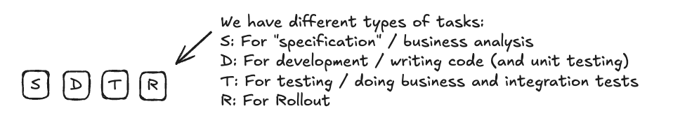
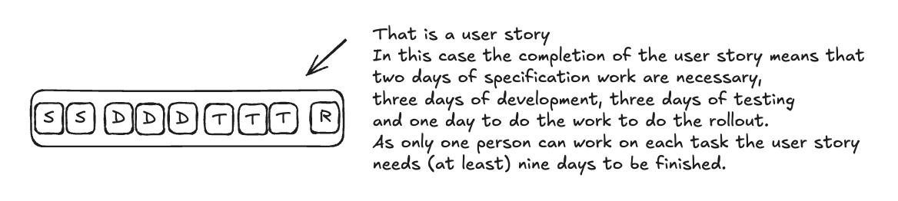
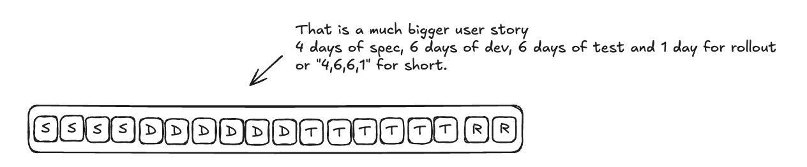
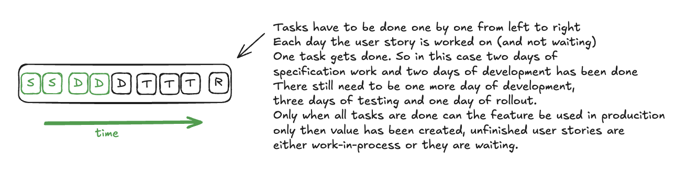
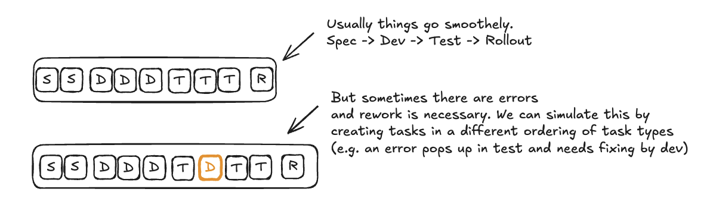
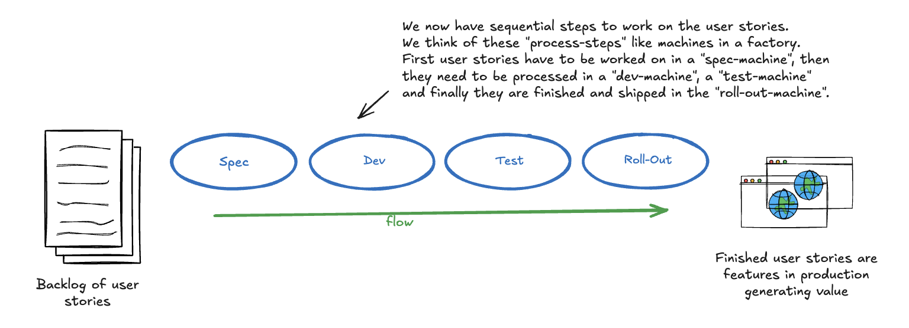
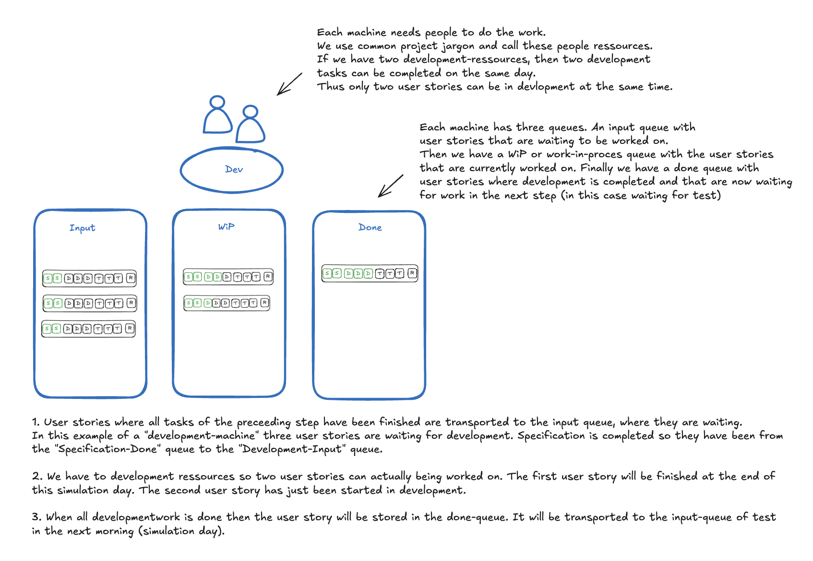
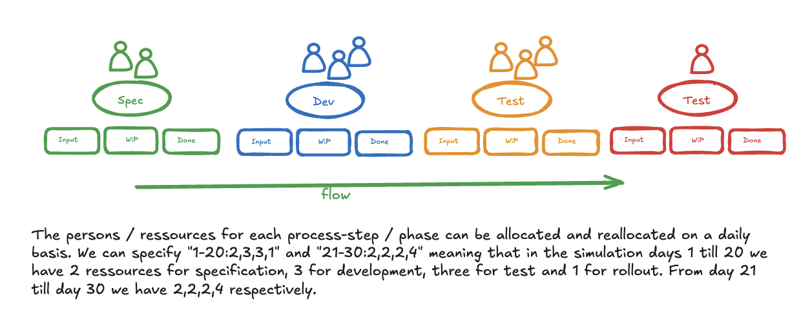
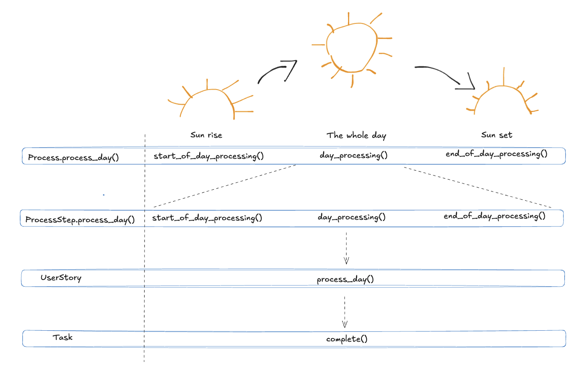

# DevCycleSim

DevCycleSim is a Python-based simulation framework for modeling agile development processes. It simulates the flow of work items (user stories) through the phases of Specification, Development, Testing, and Rollout - with built-in error handling and rework dynamics.

## Idea

The simulation represents the software development process as a factory where user stories (features/modules) pass through different production stations. Each user story has specific time requirements (in days) for the Specification, Development, Testing, and Rollout phases. For example, a story might require 1 day for Specification, 2 days for Development, 1 day for Testing, and 1 day for Rollout.

A key aspect is that a user story can only move to the next phase once its current phase is fully completed. In each phase, one person can only work on one user story at a time. So if a story requires 3 days of specification work, it occupies one full capacity unit for those 3 days. With a capacity of 2 units in the "Specification phase", a maximum of 2 stories can be processed in parallel.

Special features of the simulation:

- Flexible resource planning through ResourcePlans that define different capacities for various time periods
- Detailed statistics for each simulation day
- Support for rework by returning stories to earlier phases
- Prioritization of rework through automatic placement at the front of the queue
- Configurable story generation with random or predefined properties

This detailed modeling enables the investigation of resource constraints and process dynamics, providing valuable insights into the practical application of agile practices.

## How the simulation is working

### Modelling tasks and user stories

The most basic element in the simulation is a task. To keep things simple a task always takes one day and only one person can work on a task for that day.


There are various types of tasks. These tasks belong to phases and can only be worked on the given phase.



In the simulation we will focus on user stories and there progress through the Software-Development Live Cycle. User stories are modeled as a sequence of tasks.



User stories can be of various sizes. The relation of effort between the different phase can vary between different user stories.



User stories can be completed by completing each task in the given sequence specified for the given use story.



### Modelling errors and rework

We do not simuate errors, instead we model the rework necessary to fix the errors.



### Modelling the software development process

We simulate the software development life cycle (SDLC for short) as a sequence of process step. Each process step represents a phase in the SDLC and  can on the specific tasks in each user story. We can think of the process steps like machines in a factory. The parts in a factory are like the user stories in the SDLC. Like parts in a factory the user stories flow through the different process steps.



The number of ressources for each step are limited and specified for the szenario in the simulation. The number of ressources caps the number of user stories that can be worked on at the given simulation day.



### Modelling Ressource Allocation

The persons / ressources for each process-step / phase can be allocated and reallocated on a daily basis. We can specify "1-20:2,3,3,1" and "21-30:2,2,2,4" meaning that in the simulation days 1 till 20 we have 2 ressources for specification, 3 for development, three for test and 1 for rollout. From day 21 till day 30 we have 2,2,2,4 respectively. We call this a
resourceplan. We can set many ressourceplans following each other through teh simulation. We can set process steps to zero ressources. So everything has to wait in the input-queue of that step. By this we can simulate a situation where for example tests and rollouts are only performed in given time intervals.



### Modelling time

We move user stories, complete tasks in time increments with a fixed "Takt". This is inspired from flow engineering and
lean production. I think of these time increments as "simulation days". So each day tasks get completed and user stories might move to the next phase if all tasks of the given phase are completed. 

If you want to use hours or some other time increment, you can just reinterpret the "simulation day".

### How is the simulation working



## CLI Usage

DevCycleSim provides a command-line interface (CLI) for running simulations. Here are the main options:

```bash
devcyclesim run [OPTIONS]
```

### Options

- `--duration INTEGER`: Simulation duration in days (default: 14)
- `--resource-plan TEXT`: Format: "start-end:spec,dev,test,rollout" (can be used multiple times)
- `--resource-plans-file FILE`: JSON file with resource plans
- `--stories-file FILE`: JSON file with user stories
- `--generate-stories INTEGER`: Number of stories to generate
- `--seed INTEGER`: Random seed for reproducible results
- `--output-format [text|json|csv]`: Output format (default: text)
- `--output-file FILE`: Output file (default: stdout)
- `--verbose`: Detailed output

There is also a ```--help```feature

### Examples

1. Simple simulation with default values:

    ```bash
    devcyclesim run
    ```

2. Customized simulation with resource plan:

   ```bash
    devcyclesim run --duration 50 --resource-plan "1-25:3,4,2,1" --resource-plan "26-50:2,5,2,1"
   ```

3. Simulation with JSON files:

   ```bash
   devcyclesim run --resource-plans-file plans.json --stories-file stories.json
   ```

### JSON File Formats

#### Resource Plans (resource_plans.json)

```json
[
  {
    "start": 1,
    "end": 20,
    "resources": {
      "spec": 2,
      "dev": 3,
      "test": 2,
      "rollout": 1
    }
  },
  {
    "start": 21,
    "end": 40,
    "resources": {
      "spec": 1,
      "dev": 4,
      "test": 2,
      "rollout": 1
    }
  }
]
```

#### User Stories (stories.json)

```json
[
  {
    "id": "STORY-1",
    "spec": 2,
    "dev": 5,
    "test": 3,
    "rollout": 1,
    "arrival_day": 1,
    "priority": 1
  },
  {
    "id": "STORY-2",
    "spec": 3,
    "dev": 8,
    "test": 4,
    "rollout": 2,
    "arrival_day": 1,
    "priority": 1
  }
]
```

### Output Formats

1. Text (default):

    ```ascii
    Simulation Results:

    Day 1:
      Backlog: 3
      SPEC Input: 0
      SPEC WIP: 2
      SPEC Done: 0
      DEV Input: 0
      DEV WIP: 0
      DEV Done: 0
      TEST Input: 0
      TEST WIP: 0
      TEST Done: 0
      ROLLOUT Input: 0
      ROLLOUT WIP: 0
      ROLLOUT Done: 0
      Finished Stories: 0
    ```

2. JSON:

    ```json
    {
      "Day 1": {
        "Backlog": 3,
        "SPEC Input": 0,
        "SPEC WIP": 2,
        "SPEC Done": 0,
        "DEV Input": 0,
        "DEV WIP": 0,
        "DEV Done": 0,
        "TEST Input": 0,
        "TEST WIP": 0,
        "TEST Done": 0,
        "ROLLOUT Input": 0,
        "ROLLOUT WIP": 0,
        "ROLLOUT Done": 0,
        "Finished Stories": 0
      }
    }
    ```

3. CSV:

    ```ascii
    Day,Backlog,SPEC Input,SPEC WIP,SPEC Done,DEV Input,DEV WIP,DEV Done,TEST Input,TEST WIP,TEST Done,ROLLOUT Input,ROLLOUT WIP,ROLLOUT Done,Finished Stories
    1,3,0,2,0,0,0,0,0,0,0,0,0,0,0
    ```

### Notes

- Resource plans must not overlap in time
- If no resource plan is specified, default capacities are used:
  - SPEC: 2
  - DEV: 3
  - TEST: 3
  - ROLLOUT: 1
- The seed parameter enables reproducible simulations
- The verbose mode provides additional debug information

## Installation

### Prerequisites

- Python 3.8 or higher
- pip or uv (recommended) as package manager

### Installing dependencies

With `uv` (recommended):

```bash
uv pip install -r requirements.txt
```

Alternatively with `pip`:

```bash
pip install -r requirements.txt
```

### Installing the package

Installation in development mode:

```bash
pip install -e .
```

The `-e` flag installs the package in "editable" mode, so changes to the code are immediately effective without needing to reinstall the package.

## Detailed Model

DevCycleSim is based on a model with four main components:

### UserStory

A UserStory represents a unit of work that flows through the process.

**Attributes:**

- `story_id`: Unique identifier
- `tasks`: Array of tasks representing work in different phases
- `arrival_day`: Day when the story enters the process
- `priority`: Priority of the story
- `status`: Current status (PENDING, IN_PROGRESS, PHASE_DONE, DONE)
- `current_task_index`: Index of the current task

### ProcessStep

A ProcessStep represents a phase in the development process.

**Attributes:**

- `name`: Name of the phase
- `phase`: Associated phase (SPEC, DEV, TEST, ROLLOUT)
- `capacity`: Current capacity
- `input_queue`: Queue for incoming stories
- `work_in_progress`: Stories being processed
- `done`: Completed stories

### ResourcePlan

A ResourcePlan defines capacities for a specific time period.

**Attributes:**

- `start_day`: First day of the plan
- `end_day`: Last day of the plan
- `specification_capacity`: Capacity for SPEC
- `development_capacity`: Capacity for DEV
- `testing_capacity`: Capacity for TEST
- `rollout_capacity`: Capacity for ROLLOUT

### Process

The Process controls the entire simulation flow.

**Attributes:**

- `simulation_days`: Number of days to simulate
- `backlog`: Array of stories in backlog
- `finished_work`: Array of completed stories
- `statistics`: List of process statistics
- `resource_plans`: List of resource plans
- Process steps: `spec_step`, `dev_step`, `test_step`, `rollout_step`
