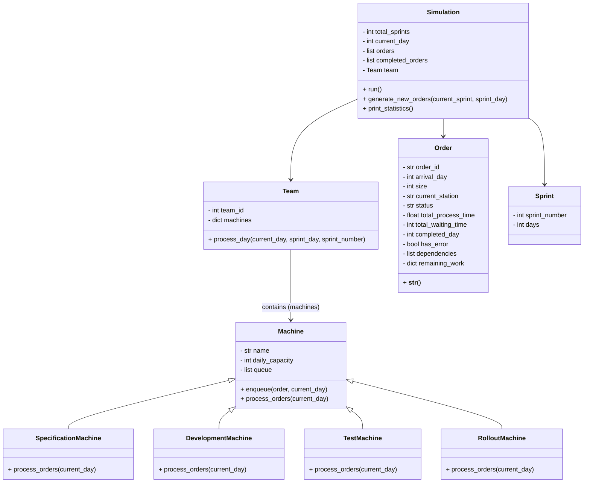
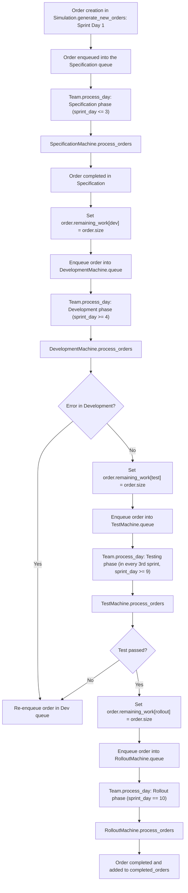

# DevCycleSim

DevCycleSim is a Python-based simulation framework designed to model agile development processes. It simulates iterative sprints where work items flow through Specification, Development, Testing, and Rollout phases—with built-in error handling and rework dynamics—to help you understand process interdependencies and effectively transfer these insights into practice.

## Overview

The framework simulates an agile workflow where each work item (order) goes through the following steps:

- **Specification:**  
  In the first three sprint days, work items are specified. New orders are generated on the first day of a sprint and enqueued in the Specification queue.

- **Development:**  
  From sprint day 4 onward, orders are processed in the Development phase. A 10% chance of error is simulated; if an error occurs, the order is re-queued into development.

- **Testing:**  
  In every third sprint (from day 9 onward), orders are tested. If the tests fail, the order is sent back to Development.

- **Rollout:**  
  On the final day of a sprint (day 10), the order is finalized and completed.

After the simulation, key metrics such as lead time, total processing time, and waiting time are displayed.

## Features

- **Order Objects:**  
  Each order includes:
  - `order_id`, `arrival_day`, `size` (story points)
  - `current_station`, `status`
  - `total_process_time` and `total_waiting_time`
  - `completed_day` and `has_error`
  - `dependencies` and a dictionary `remaining_work` (tracking remaining work for each phase: spec, dev, test, rollout)

- **Stations (Machines):**  
  The framework includes four specialized machine classes:
  - `SpecificationMachine`
  - `DevelopmentMachine`
  - `TestMachine`
  - `RolloutMachine`

- **Agile Sprints:**  
  The simulation runs in sprints of 10 working days. New orders are created at the start of each sprint.

- **Error Handling:**  
  Errors are simulated during development (10% chance). On error, orders are re-queued with reset work.

- **Statistics:**  
  At the end, all completed orders and their metrics (lead time, processing time, waiting time) are displayed.

## Project Structure

- **`simulation.py`:**  
  Contains the main driver that cycles through sprints and days, generates new orders, coordinates the workflow, and prints statistics.

- **`Order` Class:**  
  Models a work item with all relevant attributes.

- **`Machine` Class (and specialized subclasses):**  
  Provides the base class for machines as well as the specialized classes:
  - `SpecificationMachine`
  - `DevelopmentMachine`
  - `TestMachine`
  - `RolloutMachine`

- **`Team` Class:**  
  Coordinates the machines and manages the handover between phases.

- **`Sprint` Class:**  
  Models a sprint (default: 10 working days).

## Simulation Flow

1. **Generating New Orders:**  
   - On the first day of a sprint, 2 to 5 new orders are generated with a random size (3 to 8 story points) and added to the SpecificationMachine's queue.

2. **Processing in the Phases:**  
   - **Specification:** Processed during sprint days 1–3.
   - **Development:** Processed from sprint day 4 onward. If an error occurs, the order is re-queued.
   - **Testing:** In every third sprint (from day 9), orders are tested. On failure, orders are sent back to Development.
   - **Rollout:** On day 10, orders are finalized.

3. **Phase Transitions:**  
   - After Specification, the development work (`remaining_work["dev"]`) is set to the order's size, and the order is enqueued in the DevelopmentMachine.
   - Similar transitions occur from Development to Testing and from Testing to Rollout.
   - In case of errors, the work for the respective phase is reset.

4. **Evaluation:**  
   - After the simulation, all completed orders and their metrics are displayed.

## Diagrams

### UML Class Diagram

The diagram below shows the class structure and relationships among the main components:

### Flowchart (Order Flow)

This diagram visualizes the journey of an order from creation to completion:

