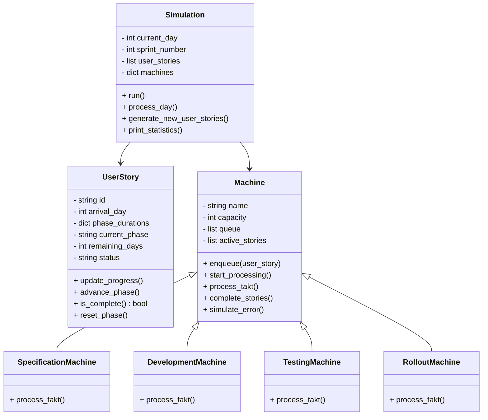
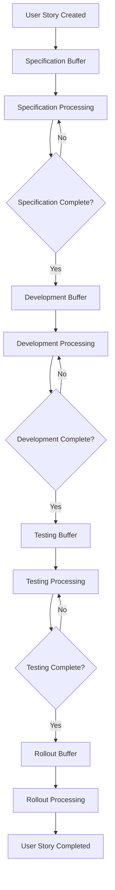

# DevCycleSim

DevCycleSim is a Python-based simulation framework designed to model agile development processes. It simulates iterative sprints where work items (user stories) flow through Specification, Development, Testing, and Rollout phases—with built-in error handling and rework dynamics—to help you understand process interdependencies and effectively transfer these insights into practice.

## Idea

The simulation represents the software development process as a factory where user stories (features/modules) pass through different production stations. Each user story comes with specified durations—in days—for the Specification, Development, Testing, and Rollout phases. For example, one user story might require 1 day for Specification, 2 days for Development, 1 day for Testing, and 1 day for Rollout, while another might require 3, 9, 4, and 1 days, respectively.

A key aspect is that a user story cannot move to the next phase until its current phase is fully completed. In the Specification phase, each person can only work on one user story at a time. Thus, if a user story requires 3 days of Specification, it will occupy one full-time equivalent (FTE) for those 3 days. With a capacity of 4 FTE in the "Specification Machine," up to 4 user stories can be processed concurrently in that phase.

This detailed modeling allows for the exploration of resource constraints and process dynamics, providing valuable insights into how agile practices can be practically applied. The entire process is divided into agile sprints (each consisting of 10 workdays), and various scenarios can be configured—for example, determining when the Testing phase becomes active or how multiple teams synchronize in phases like Testing and Rollout.

## DevCycleSim Detailed Model

Below is a more detailed model outlining the most important attributes and functions for both a **UserStory** and a **Machine** (with specialized machines for Specification, Development, Testing, and Rollout). In this model, time is measured in "takt" (days), and days are organized into sprints.

### UserStory

**Attributes:**  

- **id**  
  A unique identifier for the user story.

- **arrival_day**  
  The day when the user story is introduced into the system.

- **phase_durations**  
  A dictionary (or individual attributes) mapping each phase to the number of days required. For example:

  ```python
  {
      "spec": 1,
      "dev": 2,
      "test": 1,
      "rollout": 1
  }
  ```

- **current_phase**  
  A string representing the current phase (e.g., "spec", "dev", "test", or "rollout").

- **remaining_days**  
  The number of days remaining for the current phase. Initialized from the corresponding value in `phase_durations`.

- **status**  
  The overall status of the user story (e.g., "pending", "in progress", "completed", "error").

**Functions:**  

- **update_progress()**  
  *Description:* Decrement the `remaining_days` for the current phase by one takt (day).

- **advance_phase()**  
  *Description:* When `remaining_days` reaches zero, move the user story to the next phase and reset `remaining_days` using the next phase's duration.

- **is_complete()**  
  *Description:* Check if all phases are completed; returns `True` if the user story has passed through all phases.

- **reset_phase()**  
  *Description:* In case of an error or rework, reset the `remaining_days` for the current phase to its full duration.

### Machine

Each machine represents a production station (phase) in the simulation (e.g., Specification, Development, Testing, Rollout).

**Common Attributes:**  

- **name**  
  The name of the machine (e.g., "Specification", "Development").

- **capacity**  
  The maximum number of user stories (FTEs) that can be processed concurrently. For example, a Specification Machine with 4 FTEs can work on 4 user stories at the same time.

- **queue**  
  A FIFO list of user stories waiting to be processed.

- **active_stories**  
  A list of user stories that are currently being processed by the machine (up to its capacity).

**Common Functions:**  

- **enqueue(user_story)**  
  *Description:* Add a user story to the machine's queue.

- **start_processing()**  
  *Description:* Move user stories from the queue into `active_stories` if there is available capacity.

- **process_takt()**  
  *Description:* For one takt (day), process all active user stories by decrementing their `remaining_days`.  
  *Note:* If a user story's `remaining_days` reaches zero, it should be marked as completed for that phase.

- **complete_stories()**  
  *Description:* Identify user stories that have completed the current phase and prepare them for transition to the next phase (e.g., by invoking their `advance_phase()` method).

- **simulate_error()** (For Development and Testing machines)  
  *Description:* Randomly determine if an error occurs, which might trigger a reset of the current phase (using `reset_phase()`) and a re-queue into the same or a previous phase (for rework).

### Specialized Machines

Each specialized machine inherits from the base **Machine** class and can override or extend its functions.

- **SpecificationMachine**  
  *Behavior:* Processes user stories without simulating errors. Simply decrements the `remaining_days` in the Specification phase.

- **DevelopmentMachine**  
  *Behavior:* Processes the Development phase and may simulate errors. On an error, a user story is re-queued with its Development duration reset.

- **TestingMachine**  
  *Behavior:* Processes the Testing phase and checks for errors. If a user story fails the test, it is sent back to the Development phase (with appropriate rework).

- **RolloutMachine**  
  *Behavior:* Finalizes the user story. Once processing is complete, the user story is marked as completed.

### Simulation (Overall Controller)

**Attributes:**  

- **current_day**  
  The current day in the simulation.

- **sprint_number**  
  The current sprint number (each sprint could be, for example, 10 workdays).

- **user_stories**  
  A list of all user stories in the simulation.

- **machines**  
  A dictionary mapping phase names (e.g., "spec", "dev", "test", "rollout") to their corresponding machine objects.

**Functions:**  

- **run()**  
  *Description:* The main simulation loop that iterates through sprints and days, processes user stories across machines, and advances time.

- **process_day()**  
  *Description:* For each day (takt), instruct each machine to perform its `process_takt()` function and handle transitions between phases.

- **generate_new_user_stories()**  
  *Description:* Create and enqueue new user stories at the start of each sprint with predefined phase durations.

- **print_statistics()**  
  *Description:* Summarize and display key metrics (such as lead time, total processing time, etc.) at the end of the simulation.

This detailed model provides a clear blueprint for simulating an agile development process with realistic constraints (e.g., FTE capacity and sequential phase progression). Each user story carries its specific phase durations, and each machine processes these stories one takt (day) at a time within a sprint framework.

## Class diagram



## Flowchart



## Installation

Die Abhängigkeiten können mit `uv` installiert werden. `uv` ist ein schneller Paketmanager für Python, der `pip` ersetzt:

### Installation der Abhängigkeiten

```bash
uv pip install -r requirements.txt
```

Alternativ kann auch `pip` verwendet werden:

```bash
pip install -r requirements.txt
```

### Installation des Pakets

Um das Paket im Entwicklungsmodus zu installieren:

```bash
pip install -e .
```

Das `-e` Flag installiert das Paket im "editable" Modus, was bedeutet, dass Änderungen am Code sofort wirksam werden, ohne dass Sie das Paket neu installieren müssen.

## CLI Verwendung

DevCycleSim bietet ein Kommandozeilen-Interface (CLI) für die Ausführung von Simulationen. Hier sind die wichtigsten Optionen:

```bash
devcyclesim run [OPTIONS]
```

### Optionen

- `--team-size INTEGER`: Größe des Teams (Standard: 8)
- `--duration INTEGER`: Simulationsdauer in Tagen (Standard: 100)
- `--resource-plan TEXT`: Format: "start-end:spec,dev,test,rollout" (mehrfach verwendbar)
- `--resource-plans-file FILE`: JSON-Datei mit Resource Plans
- `--stories-file FILE`: JSON-Datei mit User Stories
- `--generate-stories INTEGER`: Anzahl der zu generierenden Stories
- `--seed INTEGER`: Zufallsseed für reproduzierbare Ergebnisse
- `--output-format [text|json|csv]`: Ausgabeformat (Standard: text)
- `--output-file FILE`: Ausgabedatei (Standard: stdout)
- `--verbose`: Detaillierte Ausgabe

### Beispiele

1. Einfache Simulation mit Standardwerten:

    ```bash
    devcyclesim run
    ```

2. Angepasste Simulation mit Resource Plan:

   ```bash
   devcyclesim run --team-size 10 --duration 50 --resource-plan "0-25:3,4,2,1" --resource-plan "26-50:2,5,2,1"
   ```

3. Simulation mit JSON-Dateien:

   ```bash
   devcyclesim run --resource-plans-file plans.json --stories-file stories.json
   ```

### JSON-Datei Formate

#### Resource Plans (resource_plans.json)

```json
[
  {
    "start": 0,
    "end": 20,
    "resources": {
      "spec": 2,
      "dev": 3,
      "test": 2,
      "rollout": 1
    }
  },
  {
    "start": 21,
    "end": 40,
    "resources": {
      "spec": 1,
      "dev": 4,
      "test": 2,
      "rollout": 1
    }
  }
]
```

#### User Stories (stories.json)

```json
[
  {
    "id": "STORY-1",
    "phase_durations": {
      "spec": 2,
      "dev": 5,
      "test": 3,
      "rollout": 1
    }
  },
  {
    "id": "STORY-2",
    "phase_durations": {
      "spec": 3,
      "dev": 8,
      "test": 4,
      "rollout": 2
    }
  }
]
```

### Ausgabeformate

1. Text (Standard):

    ```ascii
    Simulationsergebnisse:
    - Completed Stories: 5
    - Stories in Specification: 2
    - Stories in Development: 3
    - Stories in Testing: 1
    - Stories in Rollout: 0
    ```

2. JSON:

    ```json
    {
      "Completed Stories": 5,
      "Stories in Specification": 2,
      "Stories in Development": 3,
      "Stories in Testing": 1,
      "Stories in Rollout": 0
    }
    ```

3. CSV:

    ```ascii
    Metrik,Wert
    Completed Stories,5
    Stories in Specification,2
    Stories in Development,3
    Stories in Testing,1
    Stories in Rollout,0
    ```

### Hinweise

- Die Summe der Ressourcen in einem Resource Plan darf die Teamgröße nicht überschreiten
- Wenn kein Resource Plan angegeben wird, wird ein Standardplan verwendet
- Der Seed-Parameter ermöglicht reproduzierbare Simulationen
- Im verbose-Modus werden zusätzliche Debug-Informationen ausgegeben
