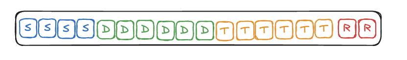

# DevCycleSim

DevCycleSim is a Python-based simulation framework for modeling agile development processes. It simulates the flow of work items (user stories) through the phases of Specification, Development, Testing, and Rollout - with built-in error handling and rework dynamics.

## Summary

The program in this repository is DevCycleSim, a Python-based simulation framework designed to model and analyze agile software development processes.

### Goal of the Program
The primary goal of DevCycleSim is to simulate the flow of work items (user stories) through the software development lifecycle (SDLC). It treats the development process like a factory production line, allowing you to investigate how different factors—such as team size, resource allocation, and rework rates—affect the overall efficiency and lead time of software delivery.

### Key Concepts & Features

**Phased Workflow:** It models the SDLC in four distinct phases:

* Specification
* Development
* Testing
* Rollout

**Resource Constraints:** Each phase has a limited capacity (number of people/resources). A user story can only be worked on if there is available capacity in that phase.

**Sequential Tasks:** User stories are modeled as a sequence of tasks. A story must complete all tasks in its current phase before moving to the next.

**Rework Dynamics:** Instead of just "errors," the simulation models rework. If a story fails a phase (e.g., testing), it can be sent back to a previous phase (e.g., development), simulating real-world bug fixing cycles.

**Resource Planning:** You can define "Resource Plans" to change team capacity over time (e.g., "Days 1-20: 2 Developers, Days 21-40: 4 Developers").
Detailed Statistics: The simulation tracks metrics like Lead Time, Work in Progress (WIP), and Efficiency, allowing you to identify bottlenecks in your process.
How it Works
You run the simulation via a CLI tool (devcyclesim), providing it with:

**User Stories:** A JSON file defining the work items and their size (effort required in each phase).
Resource Plan: A configuration of how many people are working in each phase.

**Duration:** How many "simulation days" to run.
The output (CSV, JSON, or Text) shows you exactly where stories are stuck, how long they take to complete, and how utilized your team is throughout the project.

## Idea

The simulation represents the software development process as a factory where user stories (features/modules) pass through different production stations. Each user story has specific time requirements (in days) for the Specification, Development, Testing, and Rollout phases. For example, a story might require 1 day for Specification, 2 days for Development, 1 day for Testing, and 1 day for Rollout.

A key aspect is that a user story can only move to the next phase once its current phase is fully completed. In each phase, one person can only work on one user story at a time. So if a story requires 3 days of specification work, it occupies one full capacity unit for those 3 days. With a capacity of 2 units in the "Specification phase", a maximum of 2 stories can be processed in parallel.

Special features of the simulation:

- Flexible resource planning through ResourcePlans that define different capacities for various time periods
- Detailed statistics for each simulation day
- Support for rework by returning stories to earlier phases
- Prioritization of rework through automatic placement at the front of the queue
- Configurable story generation with random or predefined properties

This detailed modeling enables the investigation of resource constraints and process dynamics, providing valuable insights into the practical application of agile practices.

## How the simulation is working

### Modelling tasks and user stories

The most basic element in the simulation is a task. To keep things simple a task always takes one day and only one person can work on a task for that day.


There are various types of tasks. These tasks belong to phases and can only be worked on the given phase.


In the simulation we will focus on user stories and there progress through the Software-Development Live Cycle. User stories are modeled as a sequence of tasks.


User stories can be of various sizes. The relation of effort between the different phase can vary between different user stories.


User stories can be completed by completing each task in the given sequence specified for the given use story.


### Modelling errors and rework

We do not simulate errors, instead we model the rework necessary to fix the errors.


### Modelling the software development process

We simulate the software development life cycle (SDLC for short) as a sequence of process step. Each process step represents a phase in the SDLC and  can on the specific tasks in each user story. We can think of the process steps like machines in a factory. The parts in a factory are like the user stories in the SDLC. Like parts in a factory the user stories flow through the different process steps.


The number of ressources for each step are limited and specified for the szenario in the simulation. The number of ressources caps the number of user stories that can be worked on at the given simulation day.


### Modelling Ressource Allocation

The persons / ressources for each process-step / phase can be allocated and reallocated on a daily basis. We can specify "1-20:2,3,3,1" and "21-30:2,2,2,4" meaning that in the simulation days 1 till 20 we have 2 ressources for specification, 3 for development, three for test and 1 for rollout. From day 21 till day 30 we have 2,2,2,4 respectively. We call this a
resourceplan. We can set many ressourceplans following each other through teh simulation. We can set process steps to zero ressources. So everything has to wait in the input-queue of that step. By this we can simulate a situation where for example tests and rollouts are only performed in given time intervals.


### Modelling time

We move user stories, complete tasks in time increments with a fixed "Takt". This is inspired from flow engineering and
lean production. I think of these time increments as "simulation days". So each day tasks get completed and user stories might move to the next phase if all tasks of the given phase are completed.

If you want to use hours or some other time increment, you can just reinterpret the "simulation day".

### How is the simulation working?


The simulation works on several levels. And there is a processing for the start of the day, the main part of the day and the end of the day in the two top-levels:

**Process level:** In the process level user stories are transported from one process-step / machine / SDLC phase to the next. If there are errors / if there is rework necessary user stories might be sent back to previous steps.

**ProcessStep level:** A process step represents a step in the process. There are the steps specification, development, test and roll-out. Each morning (in ```start_of_day_processing()```) the workload is adjusted to capacity (in ```adjust_workload_to_capacity()```). If there are free capacities for the day new user stories are moved from the input queue to the Work-in-Process queue. If a rework comes in it is worked on immediately, thus other user_stories might have to be sent back to the input-queue, as they have to wait for free ressources till the rework is done. This situation might also occur if there is a reduction in capacity / ressources in comparison to the previous day.

**UserStory level:** The user story keeps track of the status and the tasks that have been completed so far. When a task is completed the task pointer is moved to the next task (which could be worked on the next day). If this task is another phase. Then the UserStory is set to "complete" for this phase. The ProcessStep will then move it to the "Complete" Queue. Note that we just check whether the next step is from a different phase, as there might be rework. In this sense "complete" means the ressources working in the process step are considering the work done and think it is ready for the next phase.

**Task level:** A task is either done or not done (yet). The day of completion is stored for reporting purposes.

A lot of data is gathered during the simulation. Mostly in the evening (```end_of_day_processing()```).

## Example 1 - A perfectly balanced schedule

Let us study some very simple szenarios. In this example we have the following team:


Let's say we have a feature that needs a total of 180 person days to get finished. Then in this simple scenario let us assume, that we decompose the work in 20 user stories, each with 9 tasks. Like so:


As you can see the number of tasks perfectly matches the capacity within our team. The Team should be able to work very smoothely and efficiently on these stories. There should not be a bottleneck in our team. Every process step has the perfect capacity to do the job.

Although we have 3 Dev ressources in our team, one ressource can only work on one task at a time. This is a good assumption because in order to get coding done developers need some uninterrupted time to do their work. This assumption ensures that you can't speed up the work on user stories beyound the "ideal velocity".

So this means, that the teams needs 9 days to finish the first user story. Not more than two user stories can be specified simultaneously. For Dev and Test this number is 3. Only one user story can be released per day (as there is only one ROLLOUT ressource). So one story per day would be the ideal / fastest velocity.

So how do we run the simulation? First we prepare a json file with 20 of these user stories. You find the json file in the ```examples/example_1``` folder of this repo.

We start the simulation with the following command:

```bash
devcyclesim run --output-format csv --stories-file examples/example_1/base_small_user_stories.json --duration 50 --resource-plan "1-50:2,3,3,1"
```

So we simulate for 50 days and we set the size of the team to Spec: 2, Dev: 3, Test: 3, Rollout: 1.

In the output wie see thow the user stories are processed by the team:


Each row represents a simulation day, the first column is the number of the day in the simulation. So we have to read the diagram from the top to the bottom.

The other columns are each representing a user story. Whenever a task is completed by the team, then this shown in the array at the given day for the user story which contains the task.

The kind of work is indicate by a letter (S: Spec, D: Dev, T: Test, R: Rollout).

Closely inspect this graph. There are some "holes", e.g. on day 5 user story 4 has to wait for dev capacity, because user stories 1,2 and 3 already are in development. So no Dev ressource is available on day 5. The ressource shortage will be gone, when user story 1 is finished in development and is ready for testing.

We can plot the overal work like so:


The columns in the background indicate the utilization of the team ressources. So from day 9 to day 20 the team is "fully loaded".

The first user story (user-story-1) is completed on day 9 (we have 9 tasks in each story). So then after day 9 the burn-down chart is going down. The burn down chart shows the fully completed / finished user-stories (measured in number of tasks). The Work that is done starts on day one (tasks completed cumulative). As we have 9 ressources in the team max 9 tasks can be completed per day. There are twenty user stories in the backlog, so the whole backlog is worth 180 day.

The work is finished after day 28. So 28 days is the lead time for the feature that corresponds to the 20 user-stories.

The work in process is lower then 50. So max < 50 tasks are in process for the whole team.

Efficiency is calculated like so:

```math
[number of tasks in backlog] / [leadtime] * [teamsize]
```

So the efficiency is 71%.

## Example 2 - A perfectly balanced schedule but big user stories

So we have the exact same team setup as in example 1. We also have the same feature with 180 days / tasks of work.

However instead of 20 small user stoires, we have 10 big user stories. Each is build like so:



With the same considerations we conclude that the team will need at least 18 days to finish the first story.

Again we prepare a json file with the 10 user stories, that you can find in the examples folder. When we run the simulation. We get the following pattern.


We can plot the overal work like so:


The lead time is 36 days. The team is only "fully loaded" on two days. The efficiency is 56 % and there are up to >90 tasks "in the system" for the team (WIP).

## Example 3

A perfectly balanced plan, however only specification and development overlap here. The tests are started - in the sense of classical system integration tests - only when development is finished. The rollout also only occurs after the tests are completed.
The comparison with Example 1 shows the dramatic increase in lead time and work in progress due to the non-agile approach.

Even though the rollout phase would probably need to be modeled differently and is shorter compared to the other phases, the effect on lead time can already be demonstrated in this simple modeling scenario.

We adapt the resource plans so that they fit the more waterfall-like approach.

```bash
devcyclesim run --output-format csv --stories-file examples/example_1/base_small_user_stories.json --duration 80 --plot --resource-plan "1-24:2,3,0,0" --resource-plan "25-45:2,3,3,0" --resource-plan "46-80:2,3,3,1"
```

The result of the simulation looks as follows:


The lead time is 66 days. Only on day 66 is all work available in production.

## Example 4

Analoges Vorgehen für die großen User-Stories aus Example 2 führt über:

```bash
devcyclesim run --output-format csv --stories-file examples/example_2/base_big_user_stories.json --duration 80 --plot --resource-plan "1-28:2,3,0,0" --resource-plan "29-52:2,3,3,0" --resource-plan "53-80:2,3,3,1"
```

zu:


The lead time is 73 days.

## Example 5

We can now simulate error situations and analyze the impact of errors on process throughput.

We assume an error rate of 20% in development. In this scenario, we do not assume errors in the specification phase. This means that every 5th development task is assumed to have an error. As a result, after testing, the user story will require an additional development task (for fixing) and a test task (for retesting).

We have 20 user stories with 3 dev tasks each, resulting in 60 dev tasks. With a 20% error rate, we expect 12 tasks to require rework. We model this in user stories whose task numbers are divisible by 5.

These are the user stories: 2, 4, 5, 7, 9, 10, 12, 14, 15, 17, 19, 20.

Each of these receives 2 additional tasks (one dev for fixing and one test for retesting). This increases the total workload from 180 tasks to 204 tasks (+13%).

The result is as follows:


Corresponding command:

```bash
devcyclesim run --output-format csv --stories-file examples/example_5/error_small_user_stories.json --duration 80 --plot --resource-plan "1-80:2,3,3,1"
```

The lead time increases due to errors (compare Example 1) from 29 to 35 days (+20%).

With a conventional integration test approach (testing starts only after development is finished), the following result is obtained:


The lead time increases from 66 to 69 days (+5%). So, purely by the numbers, the conventional approach is relatively resilient to errors. However, it is clear that throughout the test phase, developers are repeatedly required for 2-day intervals. In practice, it is likely difficult to use this time efficiently for the next release.

Here is the command for this simulation:

```bash
```bash
devcyclesim run --output-format csv --stories-file examples/example_5/error_small_user_stories.json --duration 80 --plot --resource-plan "1-24:2,3,0,0" --resource-plan "25-48:2,3,3,0" --resource-plan "49-80:2,3,3,1"
```

## Example 6 - Feature Flow Analysis

In this scenario, we want to visualize how a specific feature (a group of 20 user stories) flows through the development process amidst the background noise of other features. We have 3 features in total, each with 20 user stories.

We want to highlight "FEATURE-1" to see its progress specifically.

Command:

```bash
devcyclesim run --stories-file examples/example_6/three_features.json --duration 100 --resource-plan "1-50:2,4,4,2" --plot --highlight-feature "FEATURE-2"
```

Result:


This visualization technique renders the target feature in vibrant colors while fading all other work into grayscale. This allows for immediate visual identification of where the specific feature is in the pipeline and how it is being processed relative to the overall system load.

## Example 7 - Fewer but Bigger Stories

This example is analogous to Example 6, but tests the impact of batch size.
- **Same total work**: 3 features, same total number of tasks.
- **Different distribution**: Instead of 20 small stories per feature, we have **10 large stories** per feature. Each story has double the task count of Example 6.

Command:

```bash
devcyclesim run --stories-file examples/example_7/three_features.json --duration 100 --resource-plan "1-50:2,4,4,2" --plot --highlight-feature "FEATURE-1"
```

Result:


This allows comparing the flow efficiency of smaller vs larger work items (Batch Size).

## CLI Usage

DevCycleSim provides a command-line interface (CLI) for running simulations. Here are the main options:

```bash
devcyclesim run [OPTIONS]
```

### Options

- `--duration INTEGER`: Simulation duration in days (default: 14)
- `--resource-plan TEXT`: Format: "start-end:spec,dev,test,rollout" (can be used multiple times)
- `--resource-plans-file FILE`: JSON file with resource plans
- `--stories-file FILE`: JSON file with user stories
- `--generate-stories INTEGER`: Number of stories to generate
- `--seed INTEGER`: Random seed for reproducible results
- `--output-format [text|json|csv]`: Output format (default: text)
- `--output-file FILE`: Output file (default: stdout)
- `--verbose`: Detailed output
- `--plot`: Plot simulation results
- `--highlight-feature TEXT`: Feature ID to highlight in the plot (e.g. "FEATURE-1")

There is also a ```--help```feature

### Examples

1. Simple simulation with default values:

    ```bash
    devcyclesim run
    ```

2. Customized simulation with resource plan:

   ```bash
    devcyclesim run --duration 50 --resource-plan "1-25:3,4,2,1" --resource-plan "26-50:2,5,2,1"
   ```

3. Simulation with JSON files:

   ```bash
   devcyclesim run --resource-plans-file plans.json --stories-file stories.json
   ```

### JSON File Formats

#### Resource Plans (resource_plans.json)

```json
[
  {
    "start": 1,
    "end": 20,
    "resources": {
      "spec": 2,
      "dev": 3,
      "test": 2,
      "rollout": 1
    }
  },
  {
    "start": 21,
    "end": 40,
    "resources": {
      "spec": 1,
      "dev": 4,
      "test": 2,
      "rollout": 1
    }
  }
]
```

#### User Stories (stories.json)

```json
[
  {
    "id": "STORY-1",
    "spec": 2,
    "dev": 5,
    "test": 3,
    "rollout": 1,
    "arrival_day": 1,
    "priority": 1
  },
  {
    "id": "STORY-2",
    "spec": 3,
    "dev": 8,
    "test": 4,
    "rollout": 2,
    "arrival_day": 1,
    "priority": 1
  }
]
```

### New User Story JSON Format

Starting with the current version, DevCycleSim supports a flexible user story format that explicitly lists the tasks of a user story as an array of phases and counts. This enables not only classic linear workflows, but also the modeling of errors and rework by allowing tasks to appear multiple times and in any order.

#### Example of the new format

```json
[
  {
    "id": "STORY-01",
    "tasks": [
      {"phase": "spec", "count": 2},
      {"phase": "dev", "count": 3},
      {"phase": "test", "count": 2},
      {"phase": "dev", "count": 1},
      {"phase": "test", "count": 1},
      {"phase": "rollout", "count": 1}
    ],
    "arrival_day": 1,
    "priority": 1
  }
]
```

**Field explanations:**

- `id`: Unique identifier for the user story.
- `tasks`: List of task objects. Each object contains:
  - `phase`: Name of the phase (`spec`, `dev`, `test`, `rollout`).
  - `count`: How many times this phase is performed consecutively (e.g., 3 development days).
- `arrival_day`: The day the story enters the process.
- `priority`: Priority of the story.

#### Flexible order for error and rework modeling

Unlike the old format, where each phase appeared only once and in a fixed order, the new format allows arbitrary and repeated phases. For example, after a test phase, another development and test phase can follow to realistically model bug fixes and rework:

```json
"tasks": [
  {"phase": "spec", "count": 2},
  {"phase": "dev", "count": 3},
  {"phase": "test", "count": 2},
  {"phase": "dev", "count": 1},   // Rework after a test failure
  {"phase": "test", "count": 1},  // Retest after rework
  {"phase": "rollout", "count": 1}
]
```

**Advantages:**

- The order of tasks can be chosen freely.
- Multiple passes through a phase are possible.
- Errors and rework can be modeled explicitly and realistically.

**Note:**
The simulation processes the tasks exactly in the order specified. For example, a bug found during testing can be represented by adding an extra development and test task before the story proceeds to rollout.

### Output Formats

1. Text (default):

    ```ascii
    Simulation Results:

    Day 1:
      Backlog: 3
      SPEC Input: 0
      SPEC WIP: 2
      SPEC Done: 0
      DEV Input: 0
      DEV WIP: 0
      DEV Done: 0
      TEST Input: 0
      TEST WIP: 0
      TEST Done: 0
      ROLLOUT Input: 0
      ROLLOUT WIP: 0
      ROLLOUT Done: 0
      Finished Stories: 0
    ```

2. JSON:

    ```json
    {
      "Day 1": {
        "Backlog": 3,
        "SPEC Input": 0,
        "SPEC WIP": 2,
        "SPEC Done": 0,
        "DEV Input": 0,
        "DEV WIP": 0,
        "DEV Done": 0,
        "TEST Input": 0,
        "TEST WIP": 0,
        "TEST Done": 0,
        "ROLLOUT Input": 0,
        "ROLLOUT WIP": 0,
        "ROLLOUT Done": 0,
        "Finished Stories": 0
      }
    }
    ```

3. CSV:

    ```ascii
    Day,Backlog,SPEC Input,SPEC WIP,SPEC Done,DEV Input,DEV WIP,DEV Done,TEST Input,TEST WIP,TEST Done,ROLLOUT Input,ROLLOUT WIP,ROLLOUT Done,Finished Stories
    1,3,0,2,0,0,0,0,0,0,0,0,0,0,0
    ```

### Notes

- Resource plans must not overlap in time
- If no resource plan is specified, default capacities are used:
  - SPEC: 2
  - DEV: 3
  - TEST: 3
  - ROLLOUT: 1
- The seed parameter enables reproducible simulations
- The verbose mode provides additional debug information

## Installation

### Prerequisites

- Python 3.8 or higher
- pip or uv (recommended) as package manager

### Installing dependencies

With `uv` (recommended):

```bash
uv pip install -r requirements.txt
```

Alternatively with `pip`:

```bash
pip install -r requirements.txt
```

### Installing the package

Installation in development mode:

```bash
pip install -e .
```

The `-e` flag installs the package in "editable" mode, so changes to the code are immediately effective without needing to reinstall the package.

## Detailed Model

DevCycleSim is based on a model with four main components:

### UserStory

A UserStory represents a unit of work that flows through the process.

**Attributes:**

- `story_id`: Unique identifier
- `tasks`: Array of tasks representing work in different phases
- `arrival_day`: Day when the story enters the process
- `priority`: Priority of the story
- `status`: Current status (PENDING, IN_PROGRESS, PHASE_DONE, DONE)
- `current_task_index`: Index of the current task

### ProcessStep

A ProcessStep represents a phase in the development process.

**Attributes:**

- `name`: Name of the phase
- `phase`: Associated phase (SPEC, DEV, TEST, ROLLOUT)
- `capacity`: Current capacity
- `input_queue`: Queue for incoming stories
- `work_in_progress`: Stories being processed
- `done`: Completed stories

### ResourcePlan

A ResourcePlan defines capacities for a specific time period.

**Attributes:**

- `start_day`: First day of the plan
- `end_day`: Last day of the plan
- `specification_capacity`: Capacity for SPEC
- `development_capacity`: Capacity for DEV
- `testing_capacity`: Capacity for TEST
- `rollout_capacity`: Capacity for ROLLOUT

### Process

The Process controls the entire simulation flow.

**Attributes:**

- `simulation_days`: Number of days to simulate
- `backlog`: Array of stories in backlog
- `finished_work`: Array of completed stories
- `statistics`: List of process statistics
- `resource_plans`: List of resource plans
- Process steps: `spec_step`, `dev_step`, `test_step`, `rollout_step`
